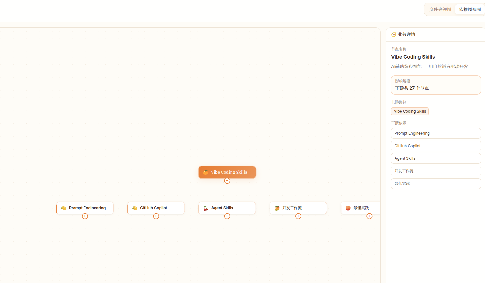

## 用户 Prompt

> 依赖图没有看到连线啊
>
> 
> 目前依赖图是这样，你看看
>
> OK

**修改时间**: 2026-02-07 12:02:15

## 概述

修复依赖图连线不可见问题，恢复“知识依赖关系可视化”能力，确保管理者可直接判断上下游影响链路。

## 修改文件清单

| 文件 | 操作 | 修改时间 | 说明 |
|------|------|----------|------|
| `web/src/components/KnowledgeGraph.tsx` | 修改 | 2026-02-07 12:00:58 | 为自定义节点补充锚点 Handle，并提升依赖边可见度与高亮效果 |
| `docs/architecture/repository-structure.md` | 修改 | 2026-02-07 12:02:10 | 同步开发日志目录新增 05 记录与截图素材目录 |
| `docs/dev_logs/2026-02-07/05-fix-graph-edge-rendering.md` | 新增 | 2026-02-07 12:02:15 | 记录本次修复方案与验证结果 |

## 具体变更描述

### 问题

依赖图页面仅显示节点卡片，不显示节点间连线，导致“关系分析”场景失效。

### 方案

1. 在 `KnowledgeNodeComponent` 中新增隐藏的 `target/source Handle`，作为边的挂载锚点。
2. 在 `buildGraph` 生成边时显式绑定 `sourceHandle: 'out'` 与 `targetHandle: 'in'`。
3. 提升边的可读性：
   - 加粗基础线宽与透明度
   - 对当前选中关系启用更高强调（加粗 + 动效）

### 影响范围

- 受影响模块：`KnowledgeGraph` 依赖图渲染逻辑
- 业务收益：关系链路重新可见，便于快速定位风险传播路径和改动影响面

## 验证结果

- ✔ `bash scripts/check_errors.sh` 通过（依赖检查 / TypeScript / ESLint / Vite build）
- ✔ `cd web && npm run test` 通过（6/6）
- ✔ `cd web && timeout 20s npm run dev -- --host 127.0.0.1 --port 4173` 启动成功（Vite ready，超时退出为预期）
